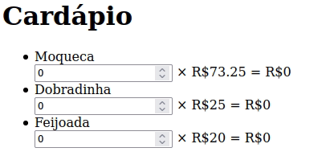

## Exercício de classe 🏫

### Cardápio

Recriar o cardápio usado como exemplo em aula.

- [ ] Permitir mudar a quantidade de cada produto
- [ ] Calcular o preço total por produto automaticamente
- [ ] Ordenar a lista automaticamente por quantidade de produtos, do maior pro menor
- [ ] Não mudar foco de input ao reordenar

Reflexões para após resolver o exercício:

- O que acontece quando não se coloca `key`? E quando se usa o índice como `key`?
- Por que é importante colocar `key` em listas de elementos no React?

---

Preencha a checklist para finalizar o exercício:

- [ ] Resolver o exercício
- [ ] Adicionar as mudanças aos commits (`git add .` para adicionar todos os arquivos ou `git add nome_do_arquivo` para adicionar um arquivo específico)
- [ ] Commitar a cada mudança significativa ou na finalização do exercício (`git commit -m "Mensagem do commit"`)
- [ ] Pushar os commits na sua branch na origem (`git push origin nome-da-branch`)
- [ ] Realizar o pull request

###### tags: `react` `key` `listas` `useRef` `useEffect`
